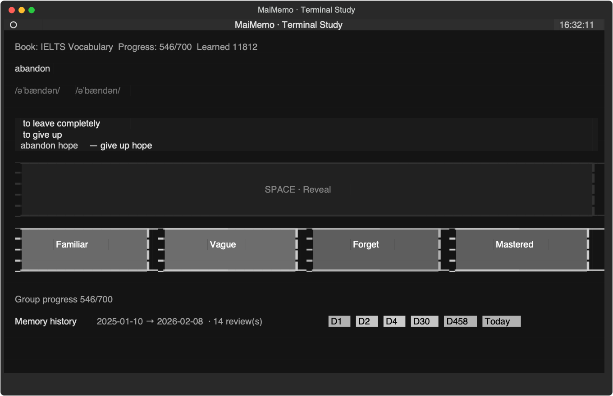

# Terminal MaiMemo

A terminal client for the MaiMemo web-study experience, built with
[Textual](https://textual.textualize.io/). Study vocabulary, reveal answers,
submit recall ratings, inspect memory history, and play pronunciation audio
without leaving the terminal.



## Highlights

- Password, SMS, or pasted `sid` credential sign-in.
- WebSocket study loop with protobuf frame encoding and decoding.
- Explicit answer reveal before a response can be submitted.
- Keyboard ratings and optional on-screen grading buttons.
- Compact memory-history markers with date and review information.
- Real pronunciation MP3 playback with automatic device fallbacks.
- Offline, schema-driven Python protobuf codec.

## Requirements

- Python 3.12 or newer
- [uv](https://docs.astral.sh/uv/)
- A MaiMemo account

## Quick start

```bash
uv sync
uv run terminal_maimemo
```

The login screen supports:

1. Password sign-in.
2. SMS code sign-in.
3. Pasting the `sid` cookie or another accepted credential value.

Credentials are stored in `~/.terminal_maimemo/config.json`. Set
`MAIMEMO_CONFIG_DIR` to use another directory.

To launch with an existing credential:

```bash
uv run terminal_maimemo --sid <SID>
```

## Study controls

| Key or control | Action |
| --- | --- |
| `Space` / `SPACE · Reveal` | Reveal the answer |
| `1` / `2` / `3` / `4` | Familiar / Vague / Forget / Mastered |
| `Backspace` | Previous word |
| `b` | Toggle on-screen grading buttons |
| `r` | Request more review words |
| `p` | Play the current pronunciation |
| `c` | Reconnect the study session |
| `l` | Log out |
| `Ctrl+Q` | Quit |

The four grading buttons are disabled by default to keep the study screen
compact. Press `b` to enable or disable them. The setting is persisted as
`show_grade_buttons` in `~/.terminal_maimemo/config.json`.

Ratings are accepted only after the answer has been explicitly revealed.
When grading buttons are enabled, the Reveal button is shown on its own row;
the rating grid wraps automatically when the terminal is narrow.

## Commands

```bash
uv run terminal_maimemo --reset
uv run terminal_maimemo --audio-diagnose
uv run terminal_maimemo --audio-test
uv run python scripts/live_test.py
uv run python tests/test_proto.py
uv run python tests/test_client.py
uv run python tests/test_study_controls.py
```

`live_test.py` performs a read-only connectivity check and never submits an
answer.

## API and protocol

The client uses the MaiMemo web-study endpoints:

```text
REST:      https://tc-apis.maimemo.com/study/api/v1/webstudy/precheck
WebSocket: wss://tc-apis.maimemo.com/study/ws/webstudy?token=
```

The WebSocket session starts with `SYSTEM_READY`, initializes through
`WEBSTUDY_INIT_STUDY`, and then requests words with `WEBSTUDY_GET_WORD`.
The decoded word response includes meanings, phrases, notes, progress,
response predictions, and `memory_history`. Responses are submitted through
`WEBSTUDY_SUBMIT_RESPONSE`.

The protocol schema in `src/terminal_maimemo/schema.json` was extracted from
the MaiMemo web-study bundle. `proto.py` provides the pure-Python codec used
by the client; no generated protobuf package is required at runtime.

## Project layout

```text
src/terminal_maimemo/
  app.py         Application entry point and CLI
  screens.py     Login and study screens
  client.py      REST and WebSocket client
  auth.py        OIDC, SMS, and password sign-in
  audio.py       Pronunciation playback and diagnostics
  config.py      Local settings and credential storage
  proto.py       Schema-driven protobuf codec
  schema.json    Extracted protocol schema
  app.tcss       Textual theme and layout
tests/           Codec, protocol, and control tests
docs/            Project screenshots
scripts/         Read-only live checks
```

## Disclaimer

This project is for personal learning use and is not affiliated with MaiMemo.
The protocol and endpoints may change. Use your own account and follow
MaiMemo's terms of service.
